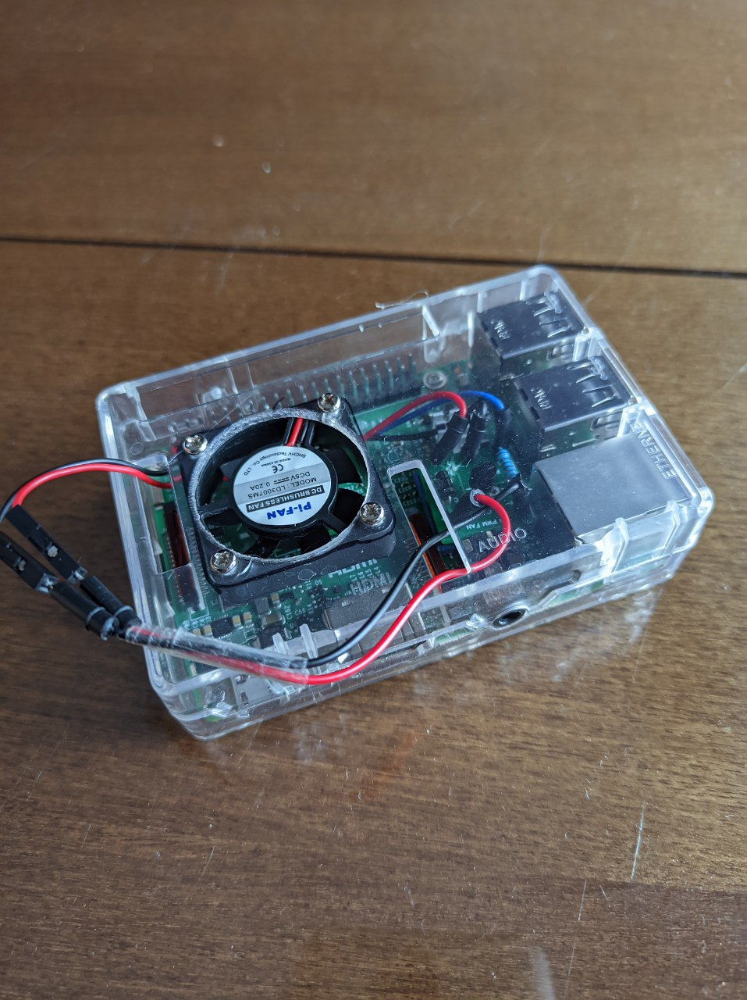
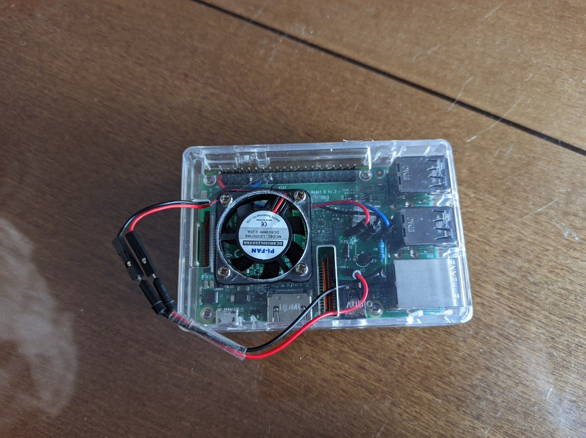
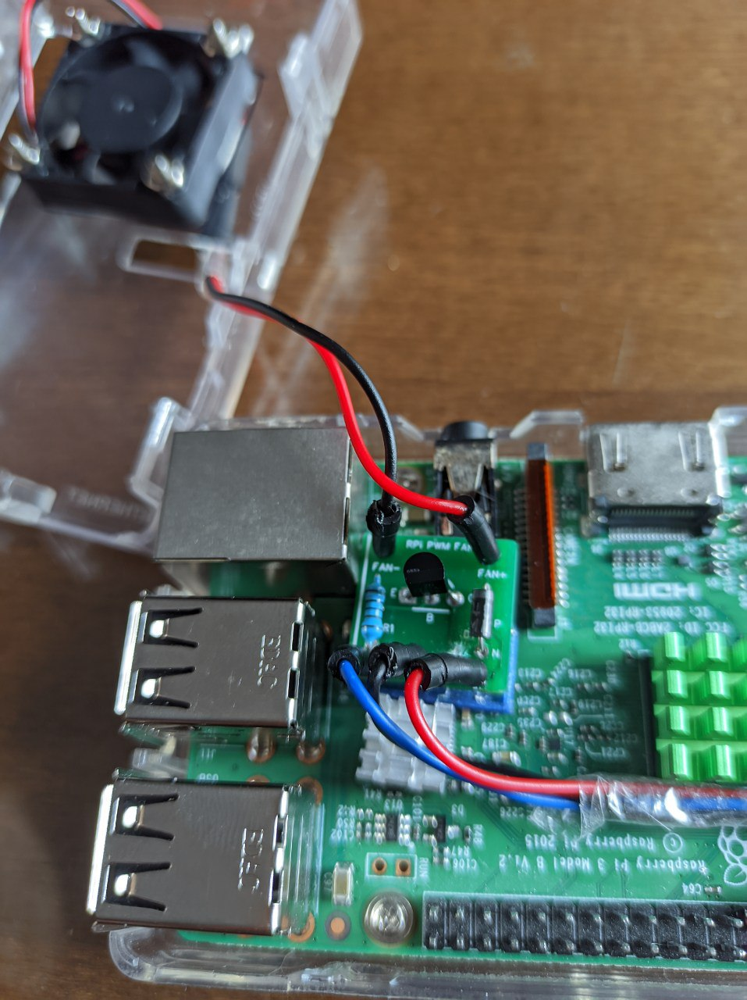
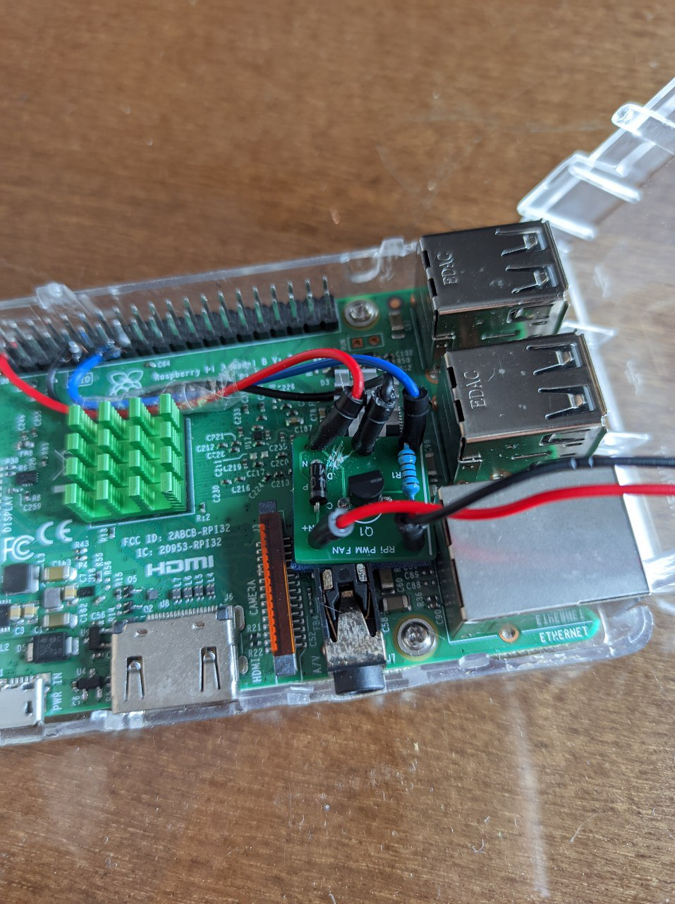

# RPi-Fan-Driver
A simple PWM-based driver for your Raspberry Pi Fan

## What is this?
This is a DIY project for adding a driver for your Raspberry Pi fan. Using its GPIO pins, some cheap components, a bit of Python code and a custom PCB, the fan can be used at various speeds depending on temperature instead of having 2 different speeds using 3.3 and 5V pins. In addition, it is beginner-friendly enough so that anyone can make this easily in a short amount of time.

## What do I need for making this myself?
Just a little bunch of things:

- A PN2222A (or similar transistor)
- A common diode that supports at least 5V and around 300-500 mA
- 1K resistor
- A bunch of jumper wires (or solder any wire to the RPi and/or PCB)
- Soldering iron
- The PCB in this repo (I ordered it at [JLCPCB](https://jlcpcb.com))

## Instructions
- First of all I recommend trying this build on a breadboard (see this [link](https://www.instructables.com/PWM-Regulated-Fan-Based-on-CPU-Temperature-for-Ras/) for extra information about building this on a breadboard)
- Once inserted all components properly on breadboard download the code from this repo with `git clone https://github.com/Pelochus/RPi-Fan-Driver.git` or download directly from `Releases` tab in github.com
- Edit both `minspeed-calibration.py` and `rpi-fan-driver.py` with your preferred GPIO pin (Note: BCM numbering is used)
- Optional: Run `minspeed-calibration.py` and insert values until you find your minimum speed for your fan (should be around 20-40%, default is 50%). **Note: Needs `rpi.gpio library` already installed**
- Optional: change tempSteps and speedSteps in `rpi-fan-driver.py`
- Now run `install.sh` as root `sudo ./install.sh`. This will only work with distros that use apt (Debian-based) and have bash. If you don't have apt you can manually install `rpi.gpio` Python library manually
- Reboot
- Make sure is working properly. Try to run any heavy task on the CPU, like a benchmark. The fan should start spinning at a certain temperature (default 45ºC) and keep increasing if temp increases
- Now, if everything works properly, solder all the components to the PCB (diode, transistor and resistor)
- Finally connect the wires to their corresponding pins in your RPi and holes in PCB. Even though I soldered the wires to the RPi, I suggest using as much as possible jumper wires
- Put the PCB in a safe place without making contact to the RPi board
- Optional: Print the .stl in this repo to protect lower part of the PCB (useful for previous step)
- Done!

## Pictures

## Credits
This [Instructables article](https://www.instructables.com/PWM-Regulated-Fan-Based-on-CPU-Temperature-for-Ras/) for providing me the electronics diagram and code to make this
